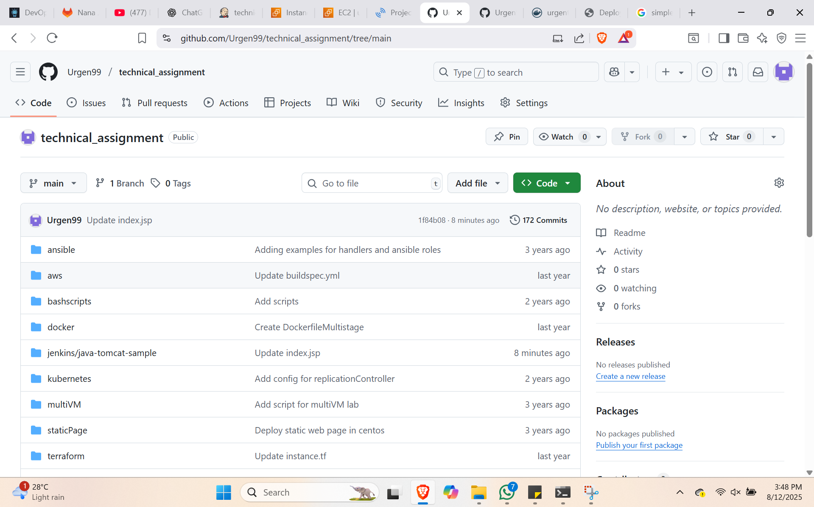
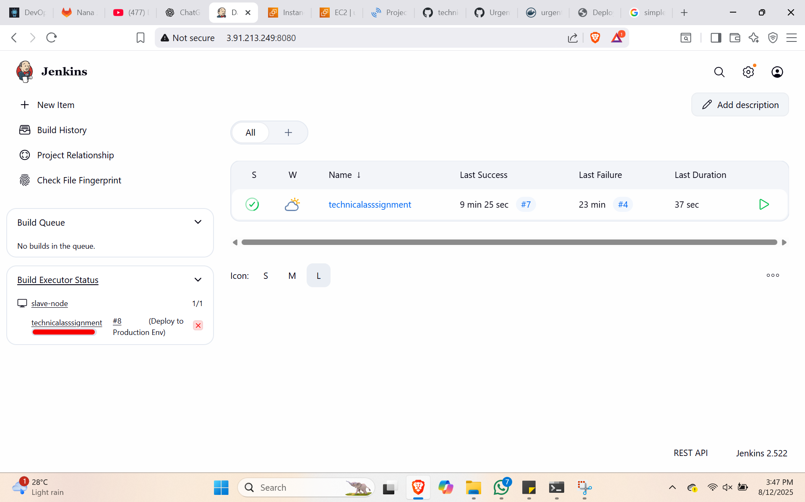
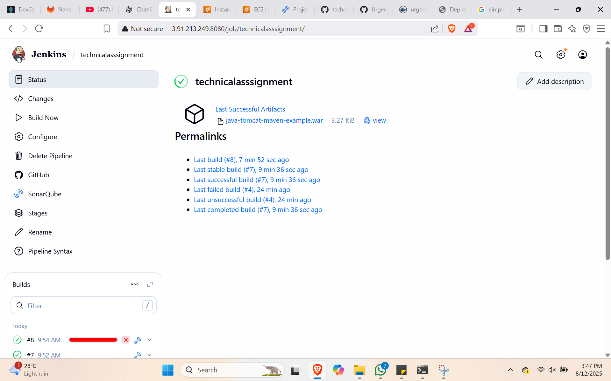
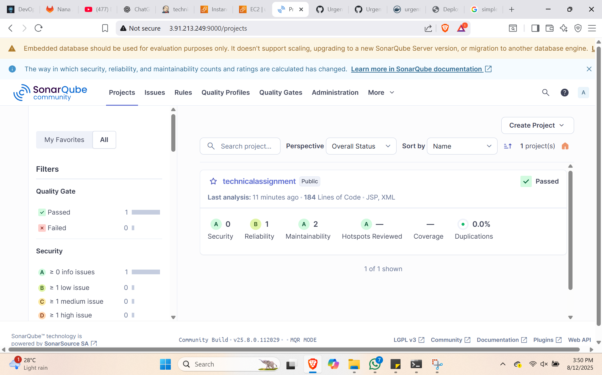
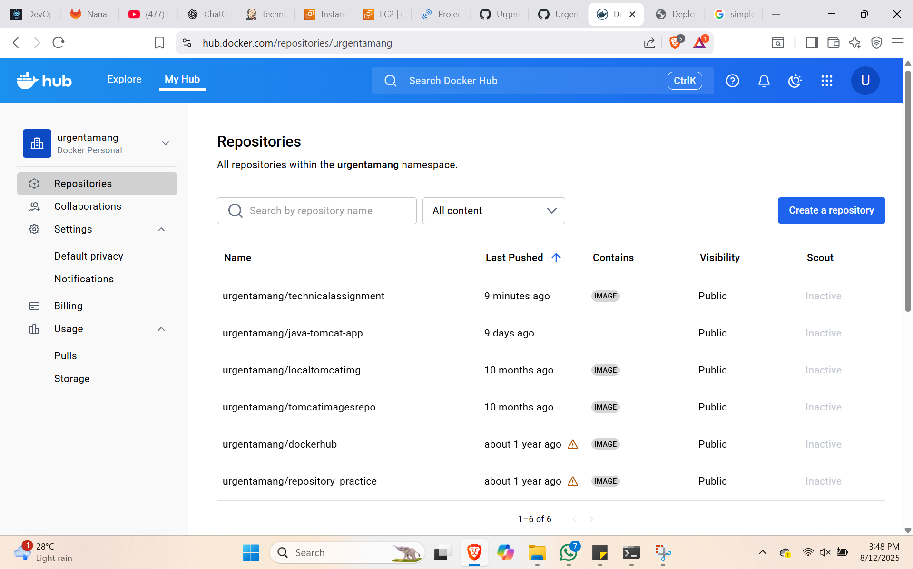
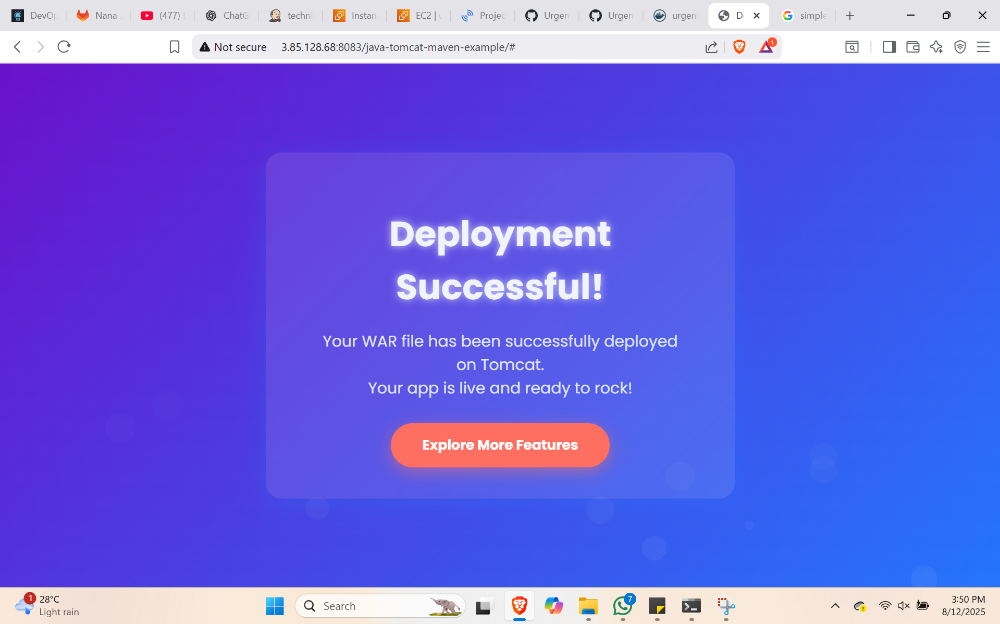
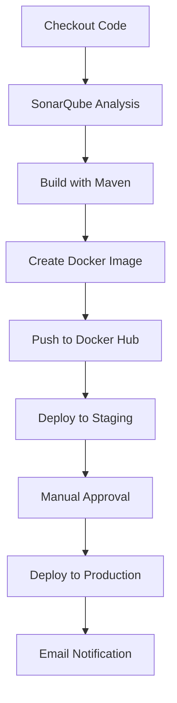

# DevOps Technical Assignment – CI/CD Pipeline with Jenkins, Docker & SonarQube

## 📌 Project Overview

This project implements a **Continuous Integration and Continuous Deployment (CI/CD)** pipeline using **Jenkins**, **Docker**, and **SonarQube** for a Java web application. The pipeline automates the process from code checkout to production deployment, ensuring quality control through static code analysis and automated email notifications.

---

## 🚀 Achievements

* **Jenkins Pipeline (Declarative)** to automate the complete build and deployment process.
* **SonarQube Integration** for static code analysis and quality gate enforcement.
* **Maven** for compiling and packaging the Java web application into a `.war` file.
* **Docker** to containerize the application using a custom **Tomcat image**.
* **Docker Hub Integration** for pushing built images to a remote repository.
* **Staging & Production Deployment** with separate Docker containers.
* **Email Notifications** for build success and failure.

---

## 🔧 Tools & Technologies

* **Jenkins** – CI/CD automation
* **SonarQube** – Code quality analysis
* **Maven** – Build automation tool
* **Docker** – Containerization
* **Docker Hub** – Image repository
* **Tomcat** – Application server
* **Mail** – Build status notifications

---

## 📂 Pipeline Stages

1. **Checkout Code** – Pulls the source code from the repository.
- 
- - 
  - - 
2. **SonarQube Analysis** – Performs static code analysis and sends results to SonarQube dashboard.
- 
3. **Build Application** – Uses Maven to package the Java application into a `.war` file.
  
4. **Create Tomcat Image** – Builds a custom Docker image with the `.war` file deployed in Tomcat.
5. **Push to Docker Hub** – Tags and uploads the image to Docker Hub.
 - 
6. **Deploy to Staging** – Runs the application in a staging environment on port **8082**.
7. **Deploy to Production** – Manual approval required; runs the application in a production environment on port **8083**.
  - 
8. **Post-Build Notifications** – Sends email notifications for build success or failure.
     - 

---

## 📜 Jenkinsfile

The complete pipeline is defined in a `Jenkinsfile`, which automates all the above steps. Below is the jenkins file:
## Jenkins Pipeline (Full Script)


```groovy
pipeline {
    agent any
    tools { 
        maven 'Default Maven' 
    }
    environment {
        SONAR_TOKEN = credentials('sonartoken')
        DOCKERHUB_CREDENTIALS = credentials('dockerhub')
        AWS_CREDENTIALS = credentials('aws-creds')
    }

    stages {
        stage('Checkout Code') {
            steps {
                echo 'Checking out source code from SCM...'
                checkout scm
            }
        }

        stage('SonarQube Analysis') {
            steps {
                withSonarQubeEnv('SonarQube') {
                    dir('jenkins/java-tomcat-sample') {
                        sh """
                        mvn clean verify sonar:sonar \
                        -Dsonar.projectKey=technicalassignment \
                        -Dsonar.projectName=technicalassignment \
                        -Dsonar.login=${SONAR_TOKEN}
                        """
                    }
                }
            }
        }

        stage('Build Docker Image') {
            steps {
                script {
                    sh "docker build -t localtomcatimg:${BUILD_NUMBER} jenkins/java-tomcat-sample"
                }
            }
        }

        stage('Push Docker Image to DockerHub') {
            steps {
                script {
                    withCredentials([usernamePassword(credentialsId: 'dockerhub', usernameVariable: 'DOCKER_USER', passwordVariable: 'DOCKER_PASS')]) {
                        sh """
                        echo "$DOCKER_PASS" | docker login -u "$DOCKER_USER" --password-stdin
                        docker tag localtomcatimg:${BUILD_NUMBER} urgentamang/technicalassignment:${BUILD_NUMBER}
                        docker push urgentamang/technicalassignment:${BUILD_NUMBER}
                        """
                    }
                }
            }
        }

        stage('Provision EC2 using Terraform') {
            steps {
                script {
                    withCredentials([usernamePassword(credentialsId: 'aws-creds', usernameVariable: 'AWS_ACCESS_KEY_ID', passwordVariable: 'AWS_SECRET_ACCESS_KEY')]) {
                        sh """
                        cd terraform
                        terraform init
                        terraform apply -auto-approve -var="instance_name=techassign-${BUILD_NUMBER}"
                        """
                    }
                }
            }
        }

        stage('Deploy using Ansible') {
            steps {
                script {
                    sh """
                    cd ansible
                    ansible-playbook -i inventory deploy.yml \
                    --extra-vars "image_tag=${BUILD_NUMBER}"
                    """
                }
            }
        }
    }

    post {
        success {
            mail to: 'team@example.com',
                 subject: "Build #${BUILD_NUMBER} Succeeded",
                 body: "The Jenkins pipeline build #${BUILD_NUMBER} completed successfully."
        }
        failure {
            mail to: 'team@example.com',
                 subject: "Build #${BUILD_NUMBER} Failed",
                 body: "The Jenkins pipeline build #${BUILD_NUMBER} has failed."
        }
    }
}
```

## 🖼️ Pipeline Flow Diagram



---

## 🔗 Example Outputs

* **SonarQube Dashboard** – Displays code quality reports.
 - 
* **Docker Hub Repository** – Stores pushed images.
 - 
* **Jenkins Console Output** – Shows build logs and deployment details.
 - 

---

## 📧 Notifications

* **Success Email** – Sent when the build completes successfully.
  - 
* **Failure Email** – Sent when the build fails, with a link to logs.

---

## ✅ Current Status

The pipeline successfully automates:

* Code checkout
* Code analysis
* Build and packaging
* Docker image creation
* Docker Hub push
* Staging & production deployment
* Email notifications
