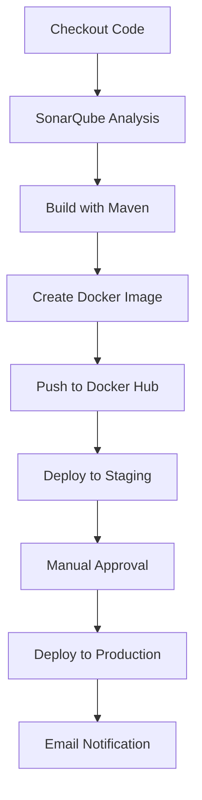

# DevOps Technical Assignment – CI/CD Pipeline with Jenkins, Docker & SonarQube

## 📌 Project Overview

This project implements a **Continuous Integration and Continuous Deployment (CI/CD)** pipeline using **Jenkins**, **Docker**, and **SonarQube** for a Java web application. The pipeline automates the process from code checkout to production deployment, ensuring quality control through static code analysis and automated email notifications.

---

## 🚀 Achievements

* **Jenkins Pipeline (Declarative)** to automate the complete build and deployment process.
* **SonarQube Integration** for static code analysis and quality gate enforcement.
* **Maven** for compiling and packaging the Java web application into a `.war` file.
* **Docker** to containerize the application using a custom **Tomcat image**.
* **Docker Hub Integration** for pushing built images to a remote repository.
* **Staging & Production Deployment** with separate Docker containers.
* **Email Notifications** for build success and failure.

---

## 🔧 Tools & Technologies

* **Jenkins** – CI/CD automation
  - 
* **SonarQube** – Code quality analysis
* **Maven** – Build automation tool
* **Docker** – Containerization
* **Docker Hub** – Image repository
* **Tomcat** – Application server
* **Mail** – Build status notifications

---

## 📂 Pipeline Stages

1. **Checkout Code** – Pulls the source code from the repository.
2. **SonarQube Analysis** – Performs static code analysis and sends results to SonarQube dashboard.
3. **Build Application** – Uses Maven to package the Java application into a `.war` file.
4. **Create Tomcat Image** – Builds a custom Docker image with the `.war` file deployed in Tomcat.
5. **Push to Docker Hub** – Tags and uploads the image to Docker Hub.
6. **Deploy to Staging** – Runs the application in a staging environment on port **8082**.
7. **Deploy to Production** – Manual approval required; runs the application in a production environment on port **8083**.
8. **Post-Build Notifications** – Sends email notifications for build success or failure.

---

## 📜 Jenkinsfile

The complete pipeline is defined in a `Jenkinsfile`, which automates all the above steps.

---

## 🖼️ Pipeline Flow Diagram

---

## 🔗 Example Outputs

* **SonarQube Dashboard** – Displays code quality reports.
* **Docker Hub Repository** – Stores pushed images.
* **Jenkins Console Output** – Shows build logs and deployment details.

---

## 📧 Notifications

* **Success Email** – Sent when the build completes successfully.
* **Failure Email** – Sent when the build fails, with a link to logs.

---

## ✅ Current Status

The pipeline successfully automates:

* Code checkout
* Code analysis
* Build and packaging
* Docker image creation
* Docker Hub push
* Staging & production deployment
* Email notifications
