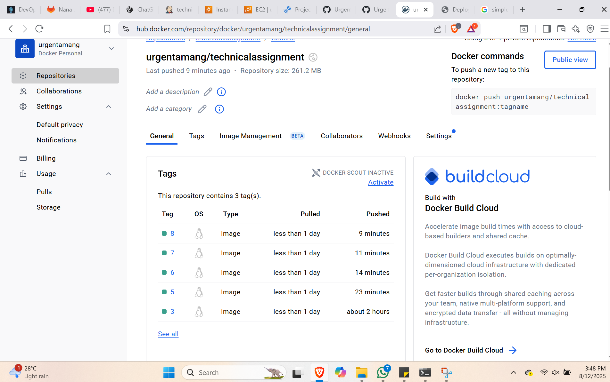

# DevOps Technical Assignment – CI/CD Pipeline with Jenkins, Docker & SonarQube

## 📌 Project Overview

This project implements a **Continuous Integration and Continuous Deployment (CI/CD)** pipeline using **Jenkins**, **Docker**, and **SonarQube** for a Java web application. The pipeline automates the process from code checkout to production deployment, ensuring quality control through static code analysis and automated email notifications.

---

## 🚀 Achievements

* **Jenkins Pipeline (Declarative)** to automate the complete build and deployment process.
* **SonarQube Integration** for static code analysis and quality gate enforcement.
* **Maven** for compiling and packaging the Java web application into a `.war` file.
* **Docker** to containerize the application using a custom **Tomcat image**.
* **Docker Hub Integration** for pushing built images to a remote repository.
* **Staging & Production Deployment** with separate Docker containers.
* **Email Notifications** for build success and failure.

---

## 🔧 Tools & Technologies

* **Jenkins** – CI/CD automation
  - 
* **SonarQube** – Code quality analysis
* **Maven** – Build automation tool
* **Docker** – Containerization
* **Docker Hub** – Image repository
* **Tomcat** – Application server
* **Mail** – Build status notifications

---

## 📂 Pipeline Stages

1. **Checkout Code** – Pulls the source code from the repository.
- 
- - 
  - - 
2. **SonarQube Analysis** – Performs static code analysis and sends results to SonarQube dashboard.
- 
3. **Build Application** – Uses Maven to package the Java application into a `.war` file.
  
4. **Create Tomcat Image** – Builds a custom Docker image with the `.war` file deployed in Tomcat.
6. **Push to Docker Hub** – Tags and uploads the image to Docker Hub.
7. - 
   - - 
8. **Deploy to Staging** – Runs the application in a staging environment on port **8082**.
9. **Deploy to Production** – Manual approval required; runs the application in a production environment on port **8083**.
  - 
11. **Post-Build Notifications** – Sends email notifications for build success or failure.

---

## 📜 Jenkinsfile

The complete pipeline is defined in a `Jenkinsfile`, which automates all the above steps. Below is the jenkins file:

pipeline {
    agent any
    tools {
        maven 'Default Maven' 
    }
    environment {
        SONAR_TOKEN = credentials('sonartoken') // Jenkins credentials ID
    }
    stages {
        stage('Checkout Code') {
            steps {
                echo 'Code already checked out by SCM. Proceeding...'
            }
        }

        stage('SonarQube Analysis') {
            steps {
                withSonarQubeEnv('SonarQube') {
                    dir('jenkins/java-tomcat-sample') {
                    sh 'mvn clean verify sonar:sonar -Dsonar.projectKey=technicalassignment -Dsonar.projectName=technicalassignment -Dsonar.token=${SONAR_TOKEN}'
                }
                }
            }
        }

        stage('Build Application') {
            steps {
                sh 'mvn -f jenkins/java-tomcat-sample/pom.xml clean package'
            }
            post {
                success {
                    echo "Now Archiving the Artifacts...."
                    archiveArtifacts artifacts: '**/*.war'
                }
            }
        }

        stage('Create Tomcat Image') {
            steps {
                copyArtifacts(
                    filter: '**/*.war',
                    fingerprintArtifacts: true,
                    projectName: env.JOB_NAME,
                    selector: specific(env.BUILD_NUMBER)
                )
                echo "Building docker image"
                sh '''
                original_pwd=$(pwd -P)
                cd jenkins/java-tomcat-sample
                docker build -t localtomcatimg:$BUILD_NUMBER .
                cd $original_pwd
                '''
            }
        }

        stage('Push to Docker Hub') {
            steps {
                withCredentials([usernamePassword(credentialsId: 'dockerhubcredentials', usernameVariable: 'DOCKER_USER', passwordVariable: 'DOCKER_PASS')]) {
                    sh '''
                    echo "$DOCKER_PASS" | docker login -u "$DOCKER_USER" --password-stdin
                    docker tag localtomcatimg:$BUILD_NUMBER urgentamang/technicalassignment:$BUILD_NUMBER
                    docker push urgentamang/technicalassignment:$BUILD_NUMBER
                    docker logout
                    '''
                }
            }
        }

        stage('Deploy to Staging Env') {
            steps {
                echo "Running app on staging env"
                sh '''
                docker stop tomcatInstanceStaging || true
                docker rm tomcatInstanceStaging || true
                docker run -itd --name tomcatInstanceStaging -p 8082:8080 localtomcatimg:$BUILD_NUMBER
                '''
            }
        }

        stage('Deploy to Production Env') {
            steps {
                timeout(time: 1, unit: 'DAYS') {
                    input message: 'Approve PRODUCTION Deployment?'
                }
                echo "Running app on Prod env"
                sh '''
                docker stop tomcatInstanceProd || true
                docker rm tomcatInstanceProd || true
                docker run -itd --name tomcatInstanceProd -p 8083:8080 localtomcatimg:$BUILD_NUMBER
                '''
            }
        }
    }
    post { 
        always { 
            mail to: 'urgentamang0909@gmail.com',
            subject: "Job '${JOB_NAME}' (${BUILD_NUMBER}) is waiting for input",
            body: "Please go to ${BUILD_URL} and verify the build"
        }
        success {
            mail bcc: '', body: """Hi Team,

    Build #$BUILD_NUMBER is successful, please go through the url

    $BUILD_URL

    and verify the details.

    Regards,
    DevOps Team""", cc: '', from: '', replyTo: '', subject: 'BUILD SUCCESS NOTIFICATION', to: 'urgentamang0909@gmail.com'
        }
        failure {
            mail bcc: '', body: """Hi Team,
            
    Build #$BUILD_NUMBER is unsuccessful, please go through the url

    $BUILD_URL

    and verify the details.

    Regards,
    DevOps Team""", cc: '', from: '', replyTo: '', subject: 'BUILD FAILED NOTIFICATION', to: 'urgentamang0909@gmail.com'
        }
    }
}

---

## 🖼️ Pipeline Flow Diagram

---

## 🔗 Example Outputs

* **SonarQube Dashboard** – Displays code quality reports.
* **Docker Hub Repository** – Stores pushed images.
* **Jenkins Console Output** – Shows build logs and deployment details.

---

## 📧 Notifications

* **Success Email** – Sent when the build completes successfully.
* **Failure Email** – Sent when the build fails, with a link to logs.

---

## ✅ Current Status

The pipeline successfully automates:

* Code checkout
* Code analysis
* Build and packaging
* Docker image creation
* Docker Hub push
* Staging & production deployment
* Email notifications
